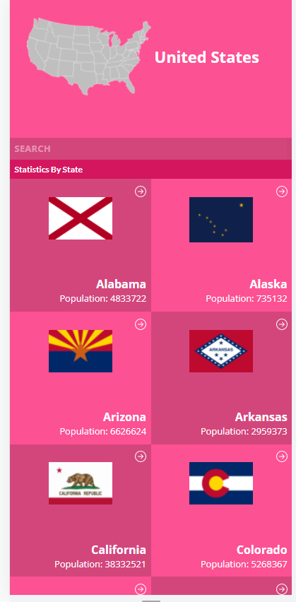
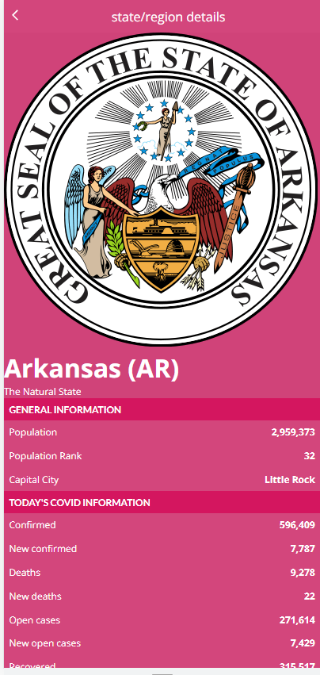

# State Covid 19 Info



Application to display information about US States and their covid statistics as per that state

## Built With
- HTML / JavaScript 
- React
- React-Redux
- React Testing Library
- Covid 19 API 

# Live Demo

Click [here](https://priceless-kirch-2b7a76.netlify.app/) to open live demo

## Presentation 

[Video Link](https://www.veed.io/view/13f85020-4960-4080-905d-71a66b6e4fe2)

## Getting Started 

To get a local copy up and running, follow the following steps:

## Prerequisites 
- A working Laptop or Desktop
- Internet 

  Clone the repo and enter the directory

```shell
git clone https://github.com/mutinhiri/covid-app && cd covid-app
```

### Install

Install the npm packages

```shell 
npm install
```

## Available Scripts

In the project directory, you can run:

### `npm start`

Runs the app in the development mode.\
Open [http://localhost:3000](http://localhost:3000) to view it in your browser.

The page will reload when you make changes.\
You may also see any lint errors in the console.

### `npm test`

Launches the test runner in the interactive watch mode.\
See the section about [running tests](https://facebook.github.io/create-react-app/docs/running-tests) for more information.

### `npm run build`

Builds the app for production to the `build` folder.\
It correctly bundles React in production mode and optimizes the build for the best performance.

## 🤝 Contributing

Feel free to contribute to this project 

Just pull an issue in the [issues page](https://github.com/mutinhiri/covid-app/issues)

Give a ⭐️ if you like this project!

## Acknowledgements

Original design idea by [Nelson Sakwa on Behance](https://www.behance.net/sakwadesignstudio).

